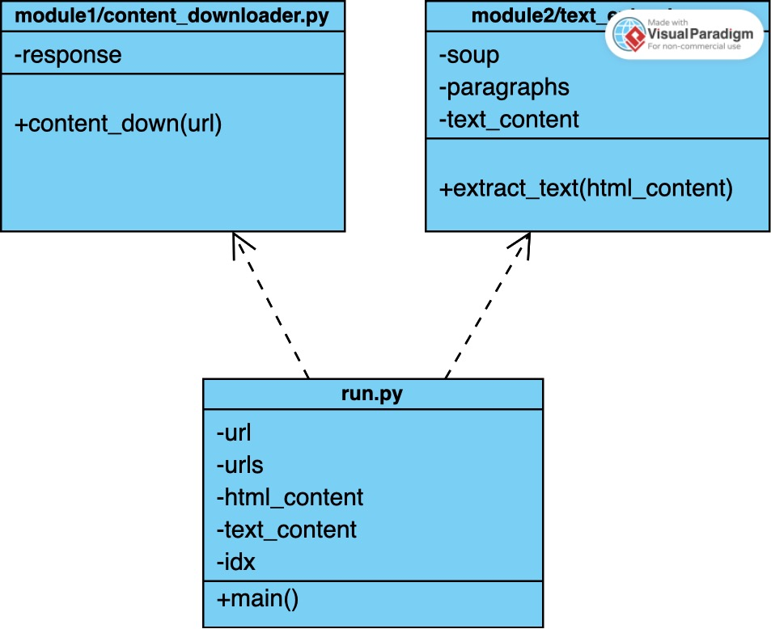

# News Scraper in Python

The News Scraper is a Python script that allows one to scrape text content from news articles on the web. It utilizes the `requests` library to fetch HTML content from specified URLs and the `BeautifulSoup` library for HTML parsing. This script can be particularly useful for tasks such as data analysis, building intelligent agents, or simply staying up-to-date with news articles without having to scroll through advertisements.

## How to Use

Follow these steps to run the News Scraper:

1. **Clone the Repository**: 
   Clone the repository containing the News Scraper script to your local machine.

2. **Initialize the Virtual Environment**:
   - Open a terminal and navigate to the directory where the News Scraper script is located.
   - Create a virtual environment named "venv" by running:
     ```
     python3 -m venv venv
     ```

3. **Activate the Virtual Environment**:
   - Activate the virtual environment by running:
     - On macOS/Linux:
       ```
       source venv/bin/activate
       ```
     - On Windows:
       ```
       .\venv\Scripts\activate
       ```

4. **Install Dependencies from requirements.yml**:
   - Instead of individually installing dependencies, you can install them from a requirements.yml file:
     ```
     conda install -n lnitzsc --file requirements.yml
     ```

5. **Run the Script**:
   - Execute the Python script by running:
     ```
     python3 python.py
     ```

6. **Deactivate the Environment**:
   - Once you're done using the script, deactivate the virtual environment by running:
     ```
     deactivate
     ```

## Output
Upon successful execution, the script will download the text content from the news articles specified in the `links.txt` file located in the folder 'Data' and subfolder 'raw'. Furthermore, each article's content will be saved to separate text files named `news_article_1.txt`, `news_article_2.txt`, and so on, to the folder 'Data' and subfolder 'processed'.

By following these steps, you can easily scrape news articles and extract text content for further analysis or consumption. Ensure to provide valid URLs in the `links.txt` file for the script to fetch the content properly.


